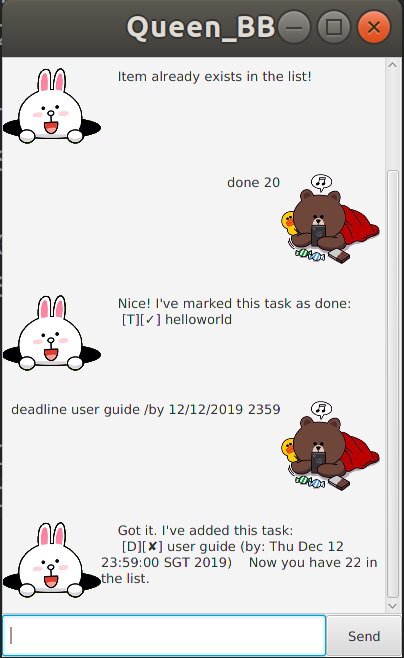

# Queen_BB User Guide

## 1. Introduction
Is keeping track of your upcoming tasks a burden? Fret not as 
Queen_BB is here to help!  
It's friendly chat-bot style interface makes task management as easy as talking to friend! Go ahead and say Hello to
 Queen_BB today!
 
### Snapshot of Queen_BB

 

## 2. Quick Start
1. Ensure you have Java `11` or above installed on your computer.
2. Download the latest `duke.jar` here.
3. Copy the file to the folder you wish to use.
4. Open your terminal and type `java -jar <path to jar file>` and hit enter. The GUI will be displayed.
5. Type a command in the text box and press `Enter` key. Queen_bb will respond accordingly.
For example, typing `list` and hitting `Enter` will display all the activities the chatbot has stored.
6. To know more about the various commands, refer to [Section 3, "Features"](#3-features).


## 3. Features
Queen_BB can store 3 types of tasks namely `todo`, `deadline`, `event`. The following are the key differences:
* `todo`: Tasks which do not have a fixed date by when they need to be accomplished.
* `deadline`: Tasks which need to be completed by a certain date and time.
* `event`: Tasks which are planned for a certain date and time.

### Task Creation 
Queen_BB allows you to create a new task by simply using the `todo`, `deadline` or `event` commands. Every new task
 is marked as not done by default.
 
 It will confirm the creation of a new task. If a task already exists, then a
  message regarding the same will be displayed.
 

### Task Completion
A task can be marked as done using the `done` command. 

### Task Deletion
A task can be deleted using the `delete` command.

### Display All Tasks
All the tasks can be easily seen using the `list` command.

### Finding a task
A task can be found by searching for the related keyword using the `find` command.

### Save All Tasks Locally
All the tasks in the list will be automatically saved in a .txt file.

### Load All Locally Saved Tasks  
All the tasks saved in the local .txt file will be loaded on launch.

### Bye
Queen_BB bids farewell.

## 4. Usage
 ### Create Todo 
 Create a new todo by typing `todo <Task to be added>`.
 
 Eg: `todo read harry potter`
 
 Expected output: 
 ```
Got it. I've added this task:
[T][X] read harry potter
Now you have 1 item in the list.
```
 
 ### Create Deadline
 Create a new deadline by typing `deadline <Task to be added> /by <DD/MM/YYYY HHMM>`.
 
 Eg: `deadline finish CS2103T homework /by 12/12/2019 2359`
 
 Expected output: 
  ```
 Got it. I've added this task:
 [D][X] finish CS2103T homework (by: Thu Dec 12 23:59:00 SGT 2019)
 Now you have 2 item in the list.
 ```
 
 ### Create Event
 Create a new event by typing `event <Task to be added> /at <DD/MM/YYYY HHMM>`.
 
 Eg: `event Orbital Splashdown /at 12/12/2019 1800`
 
 Expected output: 
 ```
  Got it. I've added this task:
  [E][X] Orbital Splashdown (by: Thu Dec 12 23:59:00 SGT 2019)
  Now you have 3 item in the list.
  ```
 
 ### Mark Task as Done
 Mark a task as done by typing `done <Task Number as per the list>`.
 
 Eg: `done 2` will mark task number 2 in the list of tasks as done
 
 Expected output: 
 ```
 Nice! I've marked this task as done:
 [D][✓] finish CS2103T homework (by: Thu Dec 12 23:59:00 SGT 2019)
 ```
 
 ### Delete a Task
 Delete a task by typing `delete <Task Number as per the list>`.
 
 Eg: `delete 2` will delete task number 2 from the list
 
 Expected output: 
  ```
  Noted. I've removed this task:
  [D][✓] finish CS2103T homework (by: Thu Dec 12 23:59:00 SGT 2019)
  Now you have 2 tasks in the list
  ```

 ### Display List
 Show all the tasks in the list.
 
 Eg: `list` will display all the tasks in the list
 
 Expected output:
 ```
 Here are the tasks in your list:
 1. [T][X] read harry potter
 2. [E][X] Orbital Splashdown (by: Thu Dec 12 23:59:00 SGT 2019)
 ```

 ### Find a Task
 Find a task by typing `find <Keyword>` .
 
 Eg: `find read` will filter all the tasks which contain the keyword `cs2103T`
 
 Expected output:
  ```
  Here are the matching tasks in your list:
  1. [T][X] read harry potter
  ```

 ### Bye
 Queen_BB replied with a goodbye message on typing `bye`.
 
 Eg: `bye`
 
 Expected output:
 ```
 Bye. Hope to see you again soon!
 ```
